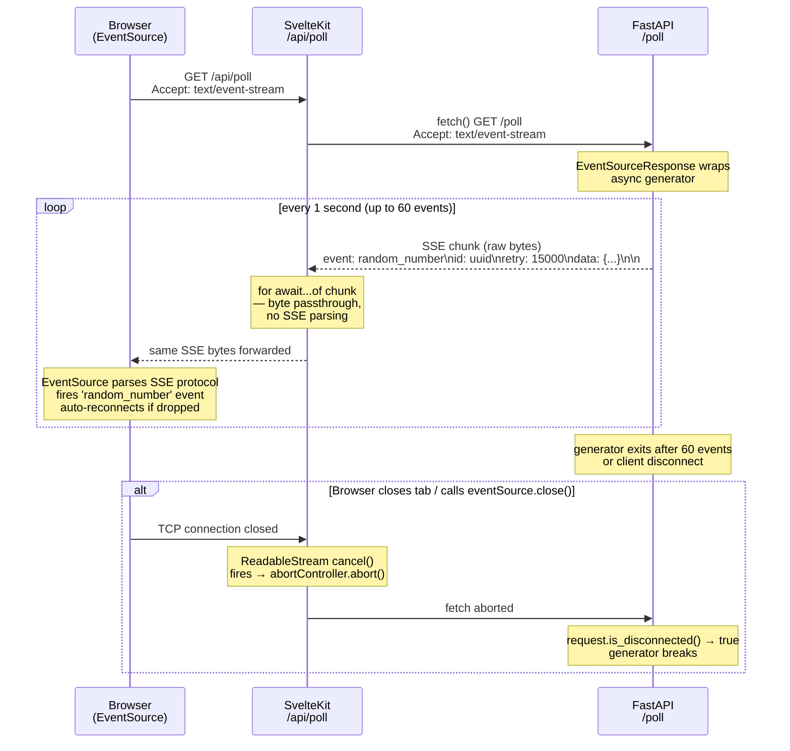

# Python -> SvelteKit SSE demo

A demo of handling server sent events (SSE) from a Python backend to SvelteKit's server and then streaming that to the SvelteKit frontend.

## Data Flow

```mermaid
sequenceDiagram
    participant B as Browser<br/>(EventSource)
    participant SK as SvelteKit<br/>/api/poll
    participant PY as FastAPI<br/>/poll

    B->>SK: GET /api/poll<br/>Accept: text/event-stream
    SK->>PY: fetch() GET /poll<br/>Accept: text/event-stream

    Note over PY: EventSourceResponse wraps<br/>async generator

    loop every 1 second (up to 60 events)
        PY-->>SK: SSE chunk (raw bytes)<br/>event: random_number\nid: uuid\nretry: 15000\ndata: {...}\n\n
        Note over SK: for await...of chunk<br/>— byte passthrough,<br/>no SSE parsing
        SK-->>B: same SSE bytes forwarded
        Note over B: EventSource parses SSE protocol<br/>fires 'random_number' event<br/>auto-reconnects if dropped
    end

    Note over PY: generator exits after 60 events<br/>or client disconnect

    alt Browser closes tab / calls eventSource.close()
        B->>SK: TCP connection closed
        Note over SK: ReadableStream cancel()<br/>fires → abortController.abort()
        SK->>PY: fetch aborted
        Note over PY: request.is_disconnected() → true<br/>generator breaks
    end
```
